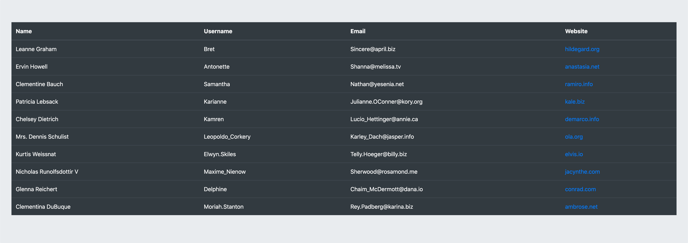

# Задание для участников вебинара — Что такое React и почему он пять лет 😱 в топе

### Задание
1. Необходимо создать ячейки таблички
    1. Имя
    2. Никнейм (username)
    3. Емейл
    4. Вебсайт (вебсайт нужно сделать в виде ссылки)
2. Отобразить сгенерированные строки таблички в теге `tbody`


### Обратите внимание

1. Файл с которым вам необходимо будет работать:
```js
src/App.js
```

2. В файле App.js предоставлены комментарии которые необходимо заменить на код

3. Данные с которыми предстоит работать представляют собой массив с объектами
```json
[
    {
        "name": "Leanne Graham",
        "username": "Bret",
        "email": "Sincere@april.biz",
        "website": "hildegard.org"
    }
]
```

4. Финальный результат должен выглядеть так:

